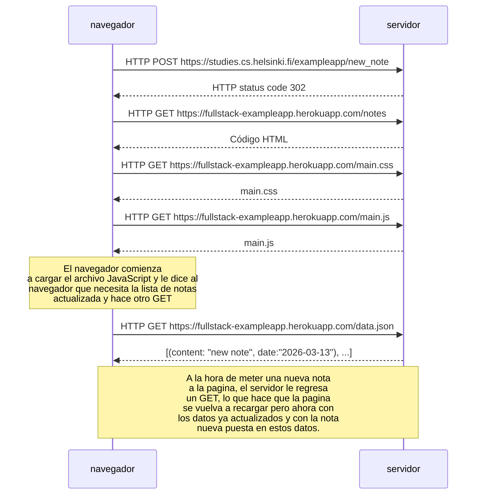

```mermaid
sequenceDiagram
    participant navegador
    participant servidor

    navegador->>servidor: HTTP POST https://studies.cs.helsinki.fi/exampleapp/new_note
    servidor-->>navegador: HTTP status code 302
    navegador ->>servidor: HTTP GET https://fullstack-exampleapp.herokuapp.com/notes
    servidor-->>navegador: Código HTML
    navegador ->>servidor: HTTP GET https://fullstack-exampleapp.herokuapp.com/main.css
    servidor-->>navegador: main.css
    navegador ->>servidor: HTTP GET https://fullstack-exampleapp.herokuapp.com/main.js
    servidor -->> navegador: main.js
    Note over navegador: El navegador comienza<br>a cargar el archivo JavaScript y le dice al <br>navegador que necesita la lista de notas <br>actualizada y hace otro GET
    navegador ->>servidor: HTTP GET https://fullstack-exampleapp.herokuapp.com/data.json
    servidor -->> navegador: [(content: "new note", date:"2026-03-13"), ...]
    Note over navegador, servidor: A la hora de meter una nueva nota <br>a la pagina, el servidor le regresa<br> un GET, lo que hace que la pagina<br>se vuelva a recargar pero ahora con <br>los datos ya actualizados y con la nota <br>nueva puesta en estos datos.
```
